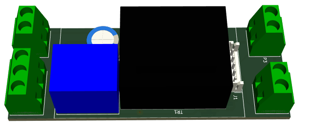
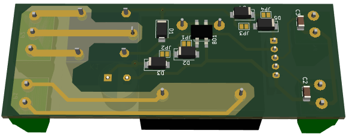
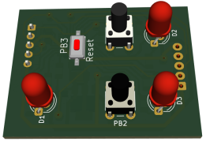
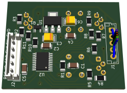
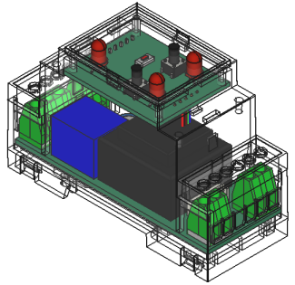
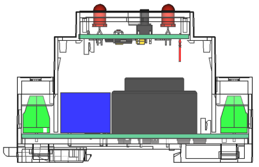

# Замечания по изготовлению.

Вообще-то минимальный необходимый функционал можно сделать на обычном реле с двумя группами контактов, и скорее всего это будет дешевле. Но вдруг, кто-то решит это повторить.... 

## Платы.

Платы (две штуки) рисовались в [Kicade](https://www.kicad.org/). Программа доступна бесплатно для скачивания и есть для Widows, Linux и вроде для iOs (не проверял - не знаю). 

К сожалению все платы двухсторонние, но ели руки растут откуда надо, то их можно и ЛУТом сделать (я так и делал). Если будете заказывать у "друзей" на производстве, то необходимые файлы для платы блока питания лежат [тут](kicad/power/gerber/), а для платы микроконтроллера [тут](kicad/mcu/stm32f030f4p6/gerber/).

Kicad лучше поставить, чтобы видеть куда какие детали впаивать. Из него же можно сделать и все необходимые файлы для изготовления плат.

### Стоимость
По стоимости, точно сложно сказать. Всё зависит от объёмов и где покупать детали. Если покупать детали в Чипе-Дипе и заказывать платы в Резоните, то цена может достичь 2500-3000 рублей. Если делать хотя-бы штук 5 и всё брать (детали и платы) в Китае (тот-же Алиэкспрес), то думаю до 1500 руб цену можно снизить. Правда стоит учитывать, что тот же Али продаёт не по 1 штуке, а по 10, 50, 100 шт.

Я потратил на изготовление 962 руб. При этом у меня была почти вся мелочевка, включая микроконтроллер, разъёмы и светодиоды. Трансформатор и корпус стоили 850 руб, т.е. почти 90 процентов затрат.

Список деталей (без учета самих плат и корпуса) можно посмотреть здесь ([силовая плата](../kicad/power/power.csv), [плата микроконтроллера](../kicad/mcu/stm32f030f4p6/mcu.csv)) или в Kicad-е.


### Силовая плата
 


Блок питания не стабилизированный - обычный выпрямитель. На схеме есть 4 диода (D2-D5). Они на самом деле сделаны на всякий случай, если трансформатор будет выдавать большое (относительно) напряжение. Ими можно  вольта на два понизить напряжение. На плате они зашунтированы перемычками. Если диоды понадобятся, то перемычки надо будет разрезать. Конденсаторы С2, С3 я тоже на всякий случай поставил, сам я их не впаивал.

Мой экземпляр трансформатора выдавал на холостом ходу 16,7В, а под нагрузкой - 12-13В.

Всё устройство потребляет порядка от выпрямителя 60-70 мА. (30 мА реле и 30 мА плата микроконтроллера)

### Плата микроконтроллера
 


Кнопка "Reset" нужна только для того, чтобы ПЕРЕпрограммировать микроконтроллер. Ножек микросхемы не хватило, пришлось использовать оду из SWD. Поэтому раз запрограммировав, второй раз можно будет только замкнув Reset во время прошивки.
Вообще я вывел на разъём программирования вход Reset микроконтроллера. Если у программатора есть такой выход и он им пользуется, то вполне возможно, что с перепрограммирование проблем не возникнет. В любом случае кнопку эту можно не впаивать, а если приспичет, замкнуть её контактные площадки, например пинцетом.

В J1 (типа разъём) впаиваем просто провода. Если впаять разъём, то он упрётся в трансформатор на силовой плате и не даст закрыть корпус.

Я паял сначала все SMD, потом переходные отверстия, а потом уже всё выводное. Кнопки брал 13 мм высотой (выступают над передней панелью на 4 мм). Если буду делать ещё, возьму высотой [11 мм](https://www.chipdip.ru/product/kls7-ts6601-11.0-180-it-1102k)


Для программирование микроконтроллера придётся найти программатор ST-Link. Оказыается их много продаётся даже на Озоне ([Первый попавшийся](https://www.ozon.ru/product/programmator-st-link-stlink-st-link-v2-dlya-stm32-i-stm8-s-kryshkoy-i-kabelem-831963679/?advert=h-PQAChD-BTeWCTxa7qK4dlZTvV8uE-_qYgWvkaRpMJ5uPkmqIrmS8EVLtGcx-RtwMC19PmU2uTwoGcULyc1hH0h3vIM2O7z9YRTU-ESkhllO_jp_jTWeFtfJOmhv_iXVRGCo6IcJjlYCQ13OU1Dy9ox44qOC-rM5EbjyZLUHykFTrlYVq7mX2Tr3UjSsagJHnD37TRqiQrH9bOOU2x3Ao7UrpY7TlK5QKuN9aPLBugav4SN5yzm7o7Nz0keoJRfOIXgLw7vr-6sMUfN2YKaTKDCYvb3uuaGosaAByVaP6qyqjRtGOzXOnGA8MErHajeLZYy8mfvz9JgO49xBM-jYm93BIo&avtc=1&avte=2&avts=1706447946&keywords=программатор+st-link+v2))
, и даже недорого. Естественно за их работоспособность я не ручаюсь. Сам покупал лет 10 назад на Алиэкспресе. 

#### Программирование микроконтроллера
##### Linux (Debian, Ubunta и другие debian-based)
Используем OpenOCD.
```
sudo apt install openocd
```
заходим в [каталог с прошивкой](../firmware/release/stm32f030f4p6/) и даём команду:
```
openocd -f interface/stlink-v2.cfg -f target/stm32f0x.cfg -c "program pump_regulator.hex verify reset" -c "shutdown"
```
На других линуксах, как-то наподобие (главное openocd поставить).

Если надо будет повторно перепрошить микроконтроллер, то нажимаем кнопу Reset (замыкаем её контакты), запускаем команду openocd.... и отпускаем кнопку. Всё должно перепрошиться.

##### Windows
У ST есть [утилиты](https://www.st.com/en/development-tools/stsw-link004.html). Правда эти не хорошие люди видимо блокируют российские IP адреса. Мне просто так скачать не дали. Наверное лучше тоже установить 
[OpenOCD](https://github.com/openocd-org/openocd/releases/download/v0.12.0/openocd-v0.12.0-i686-w64-mingw32.tar.gz), а дальше аналогично Linux.

##### macOS
Понятия не имею, скорее всего аналогично Windows.

## Корпус
Корпус Gainta D2MG (ширина 2 модуля) покупал в [ЧипеДипе](https://www.chipdip.ru/product/d2mg?from=suggest_product). Как ни странно, с учетом доставки у них оказалось дешевле всего. Есть ещё 2-х модульный корпус у [Миландра](https://meandr-shop.ru/korpus-082/), но у него не предусмотрено крепление дополнительных плат в верхней части, и с учетом доставки для меня он оказался дороже (_вообще миландровцам стоит присмотреться к корпусам Gainta, они более функциональны_).




В верхней крышке корпуса сверлим отверстия согласно [шаблона](../case/front_panel.pdf).


