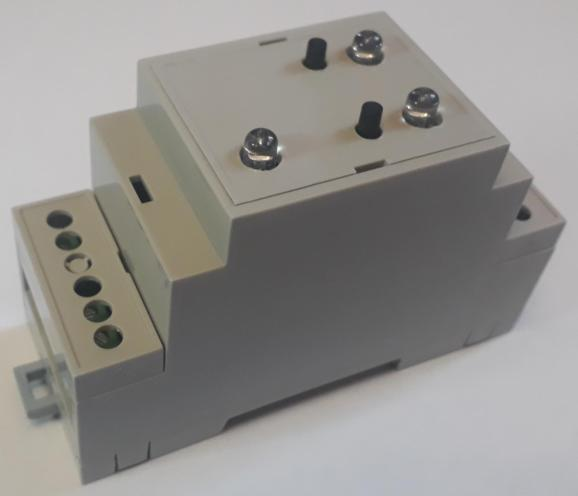
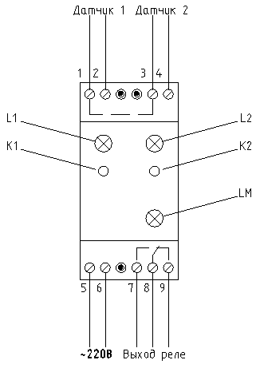
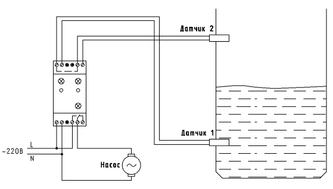
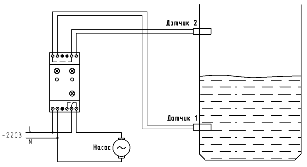
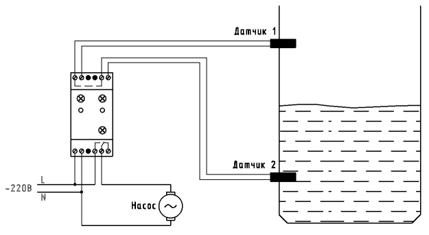

# Реле контроля уровня.
## Описание.

Позволяет контролировать уровень жидкости (откачивать/закачивать). Для контроля используются датчики с ***сухим контактом***, например:

+ [Датчик уровня жидкости герконовый](https://market.yandex.ru/product--poplavkovyi-vykliuchatel-priamoi/1811578569?sku=101921281993&do-waremd5=M3t-M77g-mPceoP2A7weeg&uniqueId=986967)
+ [Поплавковый герконовый датчик уровня воды](https://www.ozon.ru/product/liquid-level-switch-m15-poplavkovyy-gerkonovyy-datchik-urovnya-vody-zhidkosti-rezba-m15-kabel-688831200/)
+ [Поплавковый выключатель, контроль уровня воды]( https://market.yandex.ru/product--poplavkovyi-vykliuchatel-priamoi/1811578569?sku=101921281993&do-waremd5=M3t-M77g-mPceoP2A7weeg&uniqueId=986967)

Можно использовать нормально разомкнутые, нормально замкнутые контакты, а также и те и другие одновременно  (программируется каждый контакт индивидуально). Выход Реле имеет контакт нормально-замкнутый и нормально-разомкнутые контакты. 

Изначально Реле (устройство) разрабатывалось для откачки воды, но оно может быть использовано и для наполнения воды.

## Органы управления и индикации.

**Назначение клемм указано на рисунке.** Следует отметить, что клеммы 1, 3 внутри соединены между собой.

**L1, L2 - светодиоды, показывающие состояния датчиков (1 и 2 соответственно)**

| Цвет светодиода  | Описание                                           |
|------------------|----------------------------------------------------|
| Красный          | Датчик сработал                                    |
| Зеленый          | Датчик не сработал (контакт нормально-разомкнутый), т.е. контакт разомкнут.|
| Синий            | Датчик не сработал (контакт нормально-замкнутые), т.е. контакт замкнут |

**K1, K2 - кнопки управления**

Долгое нажатие (10 сек. и дольше) на одну из кнопок переключает тип датчика с нормально-разомкнутого на нормально-замкнутый и наоборот. Тип датчика сохраняется даже после отключения питания. Для нормально-разомкнутого контакта в несработанном состоянии светодиод горит Зеленым цветом, а для нормально-замкнутого - Синим.

Если нажать и удерживать (10 сек. и дольше) одновременно две кнопки, то Реле переключиться с автоматического на ручной режима работы (и наоборот).
При переходе в ручной режим работы выход Реле отключается. Режим работы не запоминается и при включении, всегда устанавливается автоматический режим.

В ручном режиме работы кнопка K1 включает выходное Реле, а кнопка K2 - выключает. Для возврата в автоматический режим надо либо отключить питание (секунды на 2-3) либо нажать и удерживать (10 сек. и дольше) одновременно две кнопки K1 и K2. 

**LM - светодиод состояния выходного реле**
| Цвет светодиода  | Описание                                     |
|------------------|----------------------------------------------|
| Красный горит    | Выходного реле включено                      |
| Зеленый горит    | Выходного реле (автоматический режим работы) |
| Синий   горит    | Выходного реле (ручной режим работы)         |

Если светодиод моргает (не важно каким цветом), значит Реле не смогло правильно прочитать из внутренней памяти (или записать в память) тип датчика. В этом случае тип всех контактов всегда будет нормально-разомкнутым. Вообще такое вряд-ли может случиться, т.к. ресурс флэш-памяти микроконтроллера реле позволят записывать не менее 100 000 раз. Чтобы затереть ячейки флэш-памяти надо будет очень часто менять типы контактов датчиков.

## Подключение.
### Откачиваем воду.
Схема подключения приведена ниже.

Самый правильный вариант, это поставить нормально-разомкнутые контакты (Датчик 1 и Датчик 2). В данном случае насос будет включаться только когда уровень воды поднимется выше Датчика 2 и будет откачивать воду пока её уровень не опустится ниже Датчика 1, или пропадёт напряжение питания (после восстановления питания, откачка воды возобновиться только, когда уровень воды опять поднимется выше датчика 2).

Если нет нормально-разомкнутых датчиков, можно поставить и нормально-замкнутые. В это случае надо будет кнопками К1, К2 поменять тип датчика (см. выше). 

### Набираем воду.

Как упоминалось в начале, Реле изначально разрабатывалось для откачки воды. Поэтому для обеспечения наборы воды есть несколько вариантов, каждый из которых имеет нюансы:

1. Назовём этот вариант "агрессивный". Т.е., если при включении  уровень воды будет ниже Датчика 2, насос включится и будет работать пока не "докачает" воду до Датчика 2. Далее он выключиться до тех пор пока уровень воды не спадёт до уровня Датчика 1. 

Подключение аналогично схеме "откачки воды", только насос подключаем к замкнутому выходному контакту Реле а не к разомкнутому.

Этот вариант меня смущает тем, что мы подключаем насос к нормально-замкнутым выходным контактам (см. схему). Вроде и ничего, но .... а вдруг Реле "сдохнет". Тогда с большей вероятностью выход отключиться, но т.к. насос подключен к нормаль-замкнутым контактам, он будет работать, пока мы его из сети не выключим.

2. Назовём это вариант "ленивый".
В данном варианте мы меняем местами датчики, и кнопками "инвертируем" состояния датчиков (программируем, см. выше), т.е. если у нас стоят нормально-разомкнутые контакты, мы их переводим в режим нормально-замкнутых, и наоборот. Насос подключаем через нормально-разомкнутые контакты Реле (как и при откачки воды).

При такой схеме включения насос будет включаться только, если уровень воды опуститься ниже Датчика 2, и работать до тех пор, пока уровень воды не достигнет Датчика 1. Здесь у нас нет минуса первого варианта, но то, что мы меняем тип контакта, возможно может сбить с толку. Мне данный вариант кажется более надежным и оптимальным.

[Кое-что про изготовление](Docs/build.md)

[Для тех, кто будет переделывать (дорабатывать)](Docs/info.md)